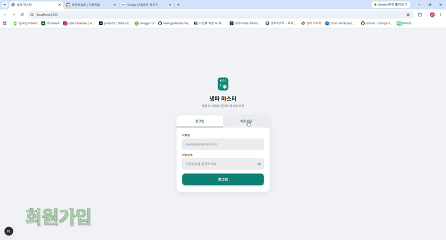

# 냉파마스터 Backend 🧊

냉파마스터는 냉장고 속 식재료를 관리하고, 소비기한 알림과 보유 재료 기반 레시피 추천을 통해 식재료 낭비를 줄이는 서비스입니다.  
백엔드는 회원 인증, 냉장고/장보기, 레시피, 댓글, 문의, 알림, 냉파 점수, 통계, 관리자 기능을 담당합니다.



## ✨ 서비스 핵심

- 🧊 냉장고 재료를 등록하고 소비기한을 관리합니다.
- 🛒 장보기 목록을 관리하고 구매한 항목을 냉장고로 반영합니다.
- 🍳 보유 재료와 선호 정보를 기반으로 레시피를 추천합니다.
- 🔔 소비기한 임박/만료, 문의 답변 알림을 제공합니다.
- 📈 냉파 점수와 만료 통계로 식재료 관리 습관을 확인합니다.
- 🛡 관리자 페이지에서 회원, 문의, 레시피, 사전 재료, 통계를 관리합니다.

## 🛠 기술 스택

| 구분 | 기술 |
| --- | --- |
| Language | Java 21 |
| Framework | Spring Boot 4.1.0 |
| Security | Spring Security, JWT |
| Database | PostgreSQL, H2 |
| Persistence | Spring Data JPA, MyBatis |
| Migration | Flyway |
| Mail | Java Mail Sender, SMTP |
| Validation | Spring Validation |
| Build | Gradle |
| Test | JUnit 5, Spring Boot Test, Mockito, MockMvc |

## 📦 주요 기능

### 👤 인증 / 회원 / 프로필

- 회원가입, 로그인, 로그아웃
- access token / refresh token 발급 및 재발급
- refresh token DB 저장 및 만료 처리
- 이메일 인증 코드 발송/확인
- 인증 코드 5회 오입력 시 재발급 요구
- 탈퇴/비활성 회원 이메일 재사용 차단
- 일반 회원과 관리자 권한 분리
- 내 정보 및 프로필 조회/수정
- 가구 유형, 선호 음식, 못 먹는 재료 관리
- 닉네임 중복 및 형식 검증

### 🧊 냉장고 / 장보기 / 사전 재료

- 냉장고 재료 등록, 조회, 수정, 삭제
- 재료 전체 사용 및 일부 사용 처리
- 소비기한 임박/만료 재료 조회
- 장보기 항목 등록, 조회, 수정, 삭제
- 장보기 구매 체크 처리 즉시 구매시 쿠팡 이동
- 장보기 항목을 냉장고 재료로 이동
- 사전 재료 검색 및 재료 카테고리 조회
- 관리자 사전 재료 등록, 수정, 비활성화, 재활성화

### 🍳 레시피 / 댓글

- 레시피 등록, 수정, 삭제
- 레시피 상세 조회
- 로그인 사용자의 보유 재료 여부와 부족 재료 계산
- 보유 재료 비율, 임박 재료, 선호 음식, 제외 재료 기반 추천
- 레시피명/재료명 키워드 검색
- 좋아요 등록/취소 및 좋아요 수 조회
- 댓글 목록 조회, 등록, 수정, 삭제
- 작성자/관리자 권한 기반 수정·삭제 제어
- 관리자 레시피 목록, 검색, 상세 조회

### 💬 문의

- 사용자 문의 등록, 목록 조회, 상세 조회
- 답변 전 문의 수정/삭제
- 답변 완료 문의 수정/삭제 제한
- 관리자 문의 목록 필터링
- 관리자 답변 등록, 수정, 삭제
- 답변 등록 시 사용자 알림 생성

### 🔔 알림 / 이메일

- 소비기한 임박 알림 생성
- 소비기한 만료 알림 생성
- 문의 답변 알림 생성
- 이메일 인증 이력 정리 스케줄러

### 📈 냉파 점수 / 사용자 통계

- 회원별 냉파 점수 조회
- 점수 산정 이력 조회
- 레시피 등록 시 점수 증가
- 만료 재료 발생 시 점수 차감
- 만료 재료가 없는 상태 4일 유지 시 점수 보상
- 카테고리별 만료량 조회
- 자주 버려지는 재료 TOP5 조회
- 최근 만료 기록 조회

### 🛡 관리자

- 회원 목록 조회, 검색, 탈퇴, 복구
- 회원 권한 변경
- 관리자 문의 관리
- 관리자 레시피 관리
- 관리자 사전 재료 관리
- 전체 회원 평균 냉파 점수 조회
- 이번 주 만료 건수 및 증감률 조회
- 카테고리별 만료량 조회
- 자주 버려지는 재료 TOP5 및 순위 변동 조회
- 최근 6주 주간 만료 추이 조회

## 🧩 프로젝트 구조

```text
src/main/java/com/naengpa/naengpamasterbackend
├── admin          # 관리자 회원/문의/레시피/재료/통계 관리
├── comment        # 레시피 댓글
├── fridge         # 냉장고 재료
├── global         # 인증, 보안, 예외, 공통 응답
├── inquiry        # 사용자 문의
├── member         # 회원, 선호 음식, 제외 재료
├── notification   # 알림
├── product        # 사전 재료, 재료 카테고리
├── recipe         # 레시피, 추천, 좋아요
├── score          # 냉파 점수, 점수 이력, 스케줄러
├── shopping       # 장보기
└── statistics     # 사용자 만료 통계
```

## 🔐 인증 흐름

1. 사용자가 이메일 인증 코드를 요청합니다.
2. 서버는 기존 회원, 탈퇴 회원 여부를 확인합니다.
3. 인증 코드를 이메일로 발송합니다.
4. 사용자가 인증 코드를 확인합니다.
5. 인증 완료 이메일로 회원가입을 진행합니다.
6. 로그인 성공 시 access token과 refresh token을 발급합니다.
7. 보호 API는 JWT 인증 정보를 기준으로 사용자와 관리자 권한을 판단합니다.

## 🍳 레시피 추천 기준

레시피 추천은 단순 목록 조회가 아니라 사용자 상태를 함께 반영합니다.

- 보유 재료 비율 계산
- 부족 재료 목록 계산
- 소비기한 임박 재료를 활용하는 레시피 가중치 부여
- 선호 음식 카테고리와 일치하는 레시피 가중치 부여
- 못 먹는 재료가 포함된 레시피 제외
- 좋아요한 레시피만 필터링 가능
- 보유 재료 80% 이상 레시피만 필터링 가능

## ⏰ 스케줄링

| 스케줄러 | 실행 시점 | 역할 |
| --- | --- | --- |
| `DailyScoreScheduler` | 매일 00:00 | 만료 재료 확인, 알림 생성, 만료 이력 저장, 냉파 점수 반영 |
| `EmailVerificationCleanupScheduler` | 매일 01:00 | 만료/오래된 이메일 인증 이력 정리 |

관리자 수동 실행 API도 제공합니다.

```text
POST /api/v1/admin/scores/run-scheduler
```

## 🧾 공통 응답

성공과 실패 모두 공통 응답 구조를 사용합니다.

```json
{
  "success": true,
  "message": "요청이 성공했습니다.",
  "data": {}
}
```

## ✅ 품질 관리 포인트

- 사용자 API와 관리자 API를 분리하고 JWT 권한 검증으로 접근 범위를 제어합니다.
- 공통 응답 형식과 전역 예외 처리로 프론트엔드가 일관된 방식으로 성공/실패를 처리할 수 있습니다.
- 요청 DTO 검증을 통해 필수값, 길이, 형식 오류가 서비스 로직까지 들어가기 전에 차단됩니다.
- 회원, 냉장고, 장보기, 문의, 댓글, 레시피 등 주요 도메인에서 본인 데이터 접근 여부를 검증합니다.
- 삭제가 필요한 주요 데이터는 soft delete로 처리해 화면 노출은 막고 이력 추적 가능성을 남깁니다.
- refresh token, 이메일 인증, 알림 읽음 상태처럼 사용자 상태가 필요한 기능은 별도 테이블로 관리합니다.
- 냉파 점수, 만료 재료 이력, 알림, 통계가 같은 흐름으로 연결되도록 스케줄러와 도메인 서비스를 분리했습니다.
- 레시피 추천은 보유 재료, 부족 재료, 선호 음식, 제외 재료, 임박 재료를 함께 계산해 사용자 맞춤 결과를 제공합니다.
- 관리자 통계 API는 평균 점수, 만료량, TOP5, 주간 추이 등 운영 지표를 분리된 응답 DTO로 제공합니다.

## ⚙️ 환경 변수

`application.yml`은 환경 변수 또는 `src/main/resources/application-secret.env` 값을 사용합니다.  
실제 비밀 값은 커밋하지 않습니다.

```properties
DB_URL=
DB_DRIVER_CLASS_NAME=
DB_USERNAME=
DB_PASSWORD=

JPA_DDL_AUTO=
JPA_OPEN_IN_VIEW=

JWT_SECRET=
JWT_EXPIRATION=
JWT_REFRESH_EXPIRATION=

MAIL_HOST=
MAIL_PORT=
MAIL_USERNAME=
MAIL_PASSWORD=
```

샘플 파일:

```text
src/main/resources/application-secret.env.example
```

## 🚀 실행 방법

### Backend

1. 환경 변수 파일을 준비합니다.

```bash
cp src/main/resources/application-secret.env.example src/main/resources/application-secret.env
```

2. `application-secret.env`에 DB, JPA, JWT, Mail 값을 채웁니다.

3. PostgreSQL DB를 실행하고, `DB_URL`이 해당 DB를 바라보는지 확인합니다.

4. IntelliJ에서 Spring Boot 애플리케이션을 실행합니다.

```text
com.naengpa.naengpamasterbackend.NaengpaMasterBackendApplication
```

### Frontend

프론트엔드 프로젝트에서 의존성을 설치한 뒤 dev 서버를 실행합니다.

```bash
cd ../front
npm install
npm run dev
```

백엔드와 프론트엔드는 각각 따로 실행해야 합니다.

## 🧪 테스트 방법

전체 테스트:

```bash
./gradlew test
```

## 🗂 데이터베이스

DDL 및 초기 SQL은 `db` 디렉토리에서 관리합니다.

```text
db/
├── SQL_init.sql
└── 냉파마스터_ddl.sql
```
